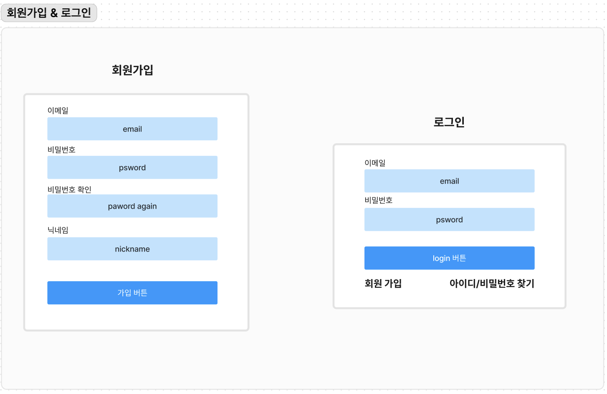
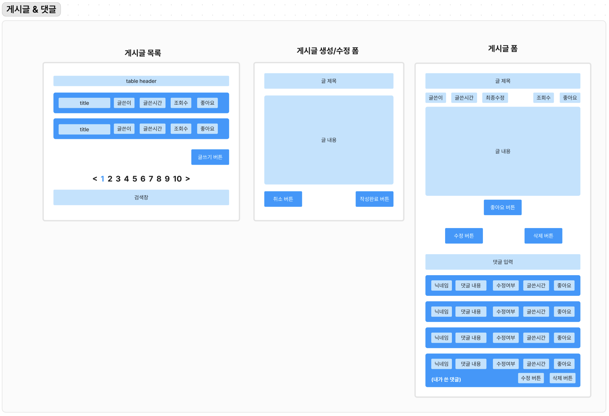
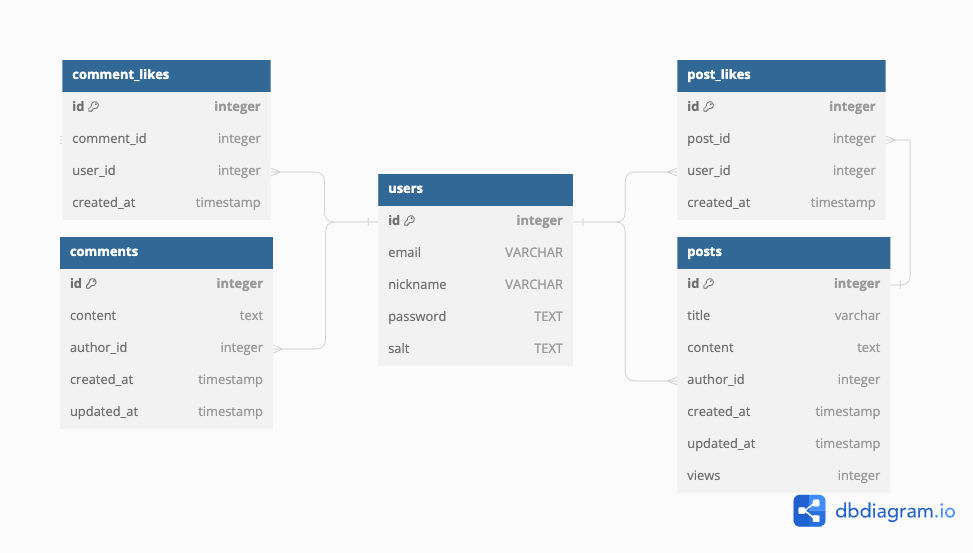

## 1. 프로젝트 MVP 그리기

### [figma 링크](https://www.figma.com/board/CQmSviDRr2qZyrxGvXK2GC/Untitled?node-id=0-1&t=NrSdD9OSbAUZcV4F-0)

- 회원가입 & 로그인

- 게시글 & 댓글

## 2. 스키마 설계

### [DBdiagram 링크](https://dbdiagram.io/d/66839ed19939893daeca688e)

- 스키마

## 3. 컨벤션
- 코드 컨벤션
    - 변수, 함수 : camelCase
    - 클래스명, 컴포넌트(폴더 + 파일) : PascalCase
    - 일반 파일, 폴더 : kebab-case
    - 세미콜론 꼭 넣기 (;)

- 커밋 컨벤션
    - [참고 블로그](https://hyunjun.kr/21)
    - header : 커밋 주 내용
    - header는 참고 블로그에 있는 것 중 상황에 맞는 것으로 쓰기
    - 만약 추가 설명이 필요할 경우 body 입력

- 브랜치 이름 컨벤션
    - feature/{구현할 기능 이름}

- Pull Request + issue 컨벤션
    - [참고 링크](https://amaran-th.github.io/Github/[Github]%20Issue%20&%20PR%20Template%20%EC%84%A4%EC%A0%95%ED%95%98%EA%B8%B0/)
    - issue : bug fix 템플릿, feature 추가 템플릿 추가
    - pull request 템플릿 추가

## 4. 프로젝트 진행 방식
- 회의 일정 조정 => 평일 14:00